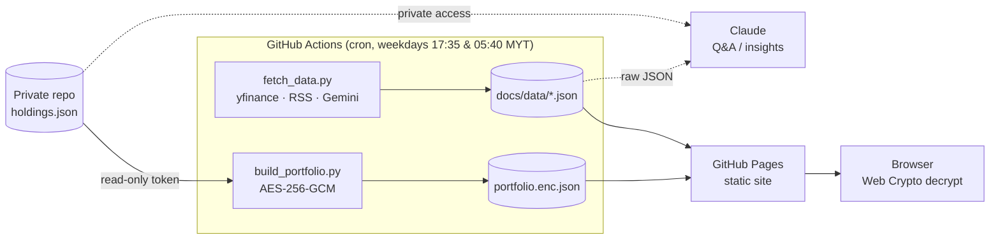

# Market Dashboard · Bursa Malaysia + US

A free, serverless market dashboard for Bursa Malaysia and US stocks. It shows trends, technical signals, news, an optional AI daily brief, and an **end-to-end encrypted personal portfolio** inside a **public** repo.

**Live:** `https://<username>.github.io/market-dashboard/` · works on phone (add to home screen) and desktop.

## What it does

| Tab | What you get |
|---|---|
| **Overview** | KLCI, USD/MYR, S&P 500, Nasdaq, VIX, gold, oil and BTC tiles with sparklines; top movers; sector/theme heat; headlines; optional AI brief (Gemini) |
| **Watchlist** | 24 stocks (Bursa + US), filtered and sorted by return, RSI or distance from the 52-week high. Tap one for price/candle charts with 50-/200-day averages, RSI, fundamentals, signals and news |
| **Signals** | Rules-based screens (uptrend, near 52-week high, oversold, overbought, unusual volume, value) plus a plain-English glossary |
| **News** | Google News + Yahoo Finance headlines by topic and per stock |
| **Portfolio** | Your holdings with P/L, day change, allocation and value history, **decrypted in your browser** |

## Architecture

- **No server, no database, no cost.** Actions runs the Python job on a schedule and commits JSON. Pages serves the static front end (vanilla JS, [lightweight-charts](https://github.com/tradingview/lightweight-charts)).
- `docs/data/history/` keeps a compact snapshot per session, so trends over time can be analysed later.

## Security model (public repo, private holdings)

1. Real holdings live only in a **private** repo (`market-dashboard-private/holdings.json`).
2. The workflow checks that repo out with a **fine-grained, read-only token** (`PRIVATE_REPO_TOKEN`). The checkout is deleted before the commit step, and `.gitignore` blocks `holdings.json`.
3. `build_portfolio.py` values positions **in memory** without writing public price files for them, so the repo doesn't reveal what you hold. It then encrypts the result with **AES-256-GCM**, using a key derived from `HOLDINGS_PASSPHRASE` via **PBKDF2-SHA256 (600k iterations)**, with a fresh IV every run.
4. The browser derives the key with the Web Crypto API and decrypts locally. With "keep unlocked", it stores only a **non-extractable `CryptoKey`** in IndexedDB, never the passphrase.

What stays visible: the watchlist, and the fact that an encrypted portfolio file exists and when it changed.

## Setup

1. Fork or push this repo (it must be public for free Pages).
2. **Settings → Pages → Build and deployment:** *Deploy from a branch*, `main`, `/docs`.
3. **Actions → Update market data → Run workflow** fills in the first data.
4. *(Optional)* **AI brief:** get a free key at <https://aistudio.google.com/apikey> and add a repo secret named `GEMINI_API_KEY`.

### Portfolio setup (optional)

1. Create a **private** repo `market-dashboard-private` containing `holdings.json` (see `holdings.example.json`).
2. Create a **fine-grained personal access token**: *Only select repositories →* `market-dashboard-private`, *Repository permissions → Contents: Read-only*.
3. In this repo, go to **Settings → Secrets and variables → Actions** and add:
   - `PRIVATE_REPO_TOKEN`: the token
   - `HOLDINGS_PASSPHRASE`: a long passphrase (4+ random words)
4. Run the workflow, open the **Portfolio** tab and unlock it.

## Customise

- **Watchlist / indices / news topics:** edit `config.json` (Yahoo symbols; Bursa stocks end in `.KL`). Pushing the change reruns the job.
- **Schedule:** edit the cron lines in `.github/workflows/update-data.yml` (times are in UTC).

## Tech

Python 3.12 (pandas, yfinance, feedparser, cryptography) · GitHub Actions · GitHub Pages · vanilla JS · Web Crypto API · lightweight-charts · responsive, dark mode, installable as a PWA.

> Data comes from Yahoo Finance (unofficial, delayed) and Google News RSS. This is a learning project and not financial advice.
