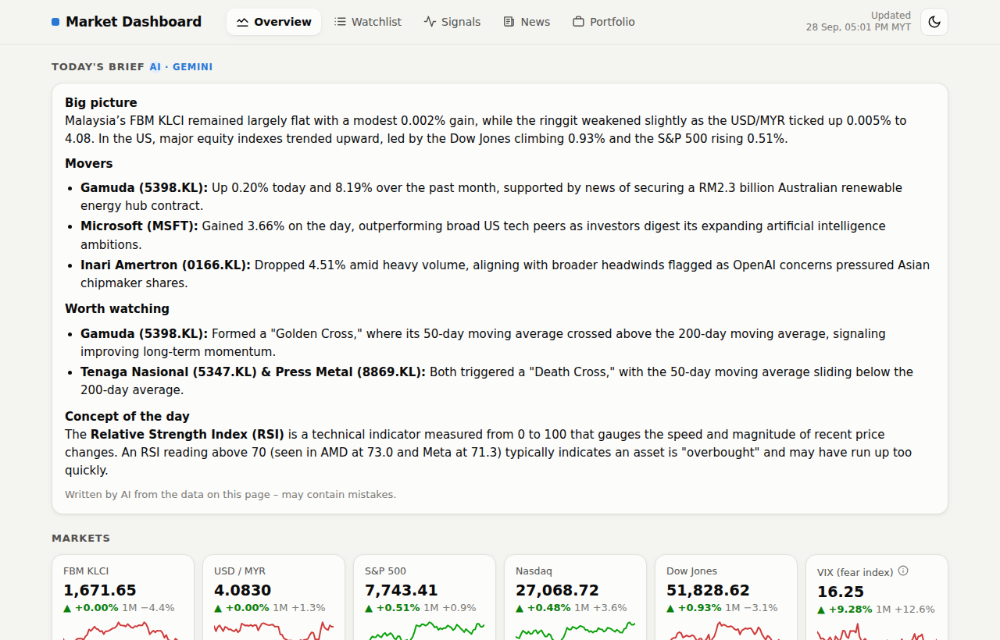
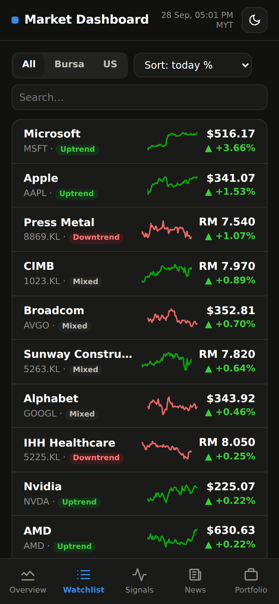
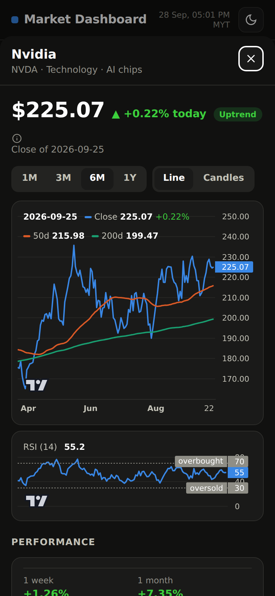
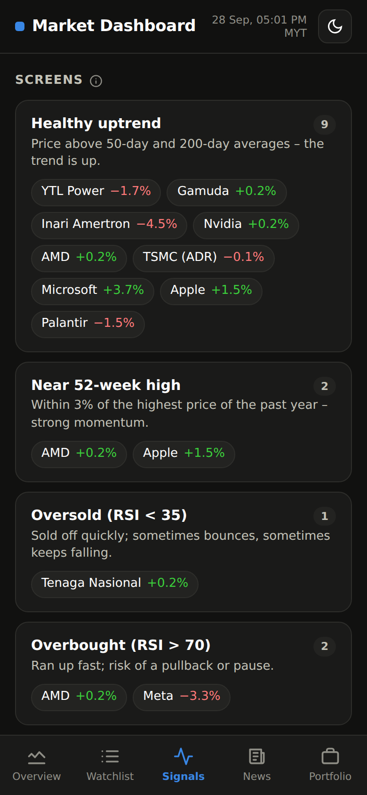
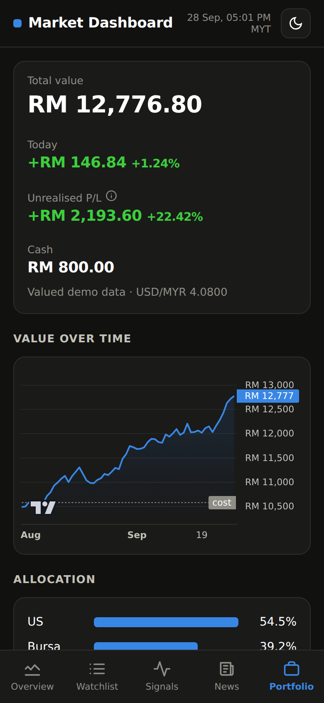
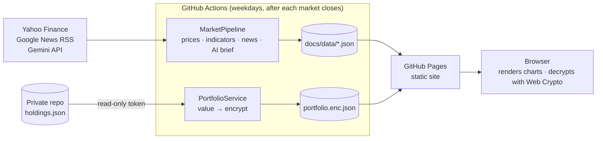

# Market Dashboard: Bursa Malaysia + US

A serverless market dashboard that tracks Bursa Malaysia and US stocks. It shows trends, technical signals, news and a daily AI-written brief, plus a personal portfolio view that is **end-to-end encrypted even though the repository is public**.

It runs entirely on free infrastructure: GitHub Actions fetches and analyses the data on a schedule, and GitHub Pages serves a static, installable web app that works on phone and desktop.

**▶ Live demo: [ericgwh0527.github.io/market-dashboard](https://ericgwh0527.github.io/market-dashboard/)**

<p align="center">
  
</p>
<p align="center">
  
  
  
  
</p>
<p align="center"><sub>The portfolio screenshot uses demo data. The live portfolio tab is locked.</sub></p>

## Features

| Tab | What it shows |
|---|---|
| **Overview** | AI daily brief (Gemini). Tiles for KLCI, USD/MYR, S&P 500, Nasdaq, Dow, VIX, US 10Y, gold, oil and BTC with sparklines. Top movers, theme/sector heat and headlines |
| **Watchlist** | 24 Bursa and US stocks, filterable and sortable by return, RSI or distance from the 52-week high. Each stock opens a detail sheet: line/candle chart with 50/200-day averages, RSI panel, performance, technicals, valuation, signals and news |
| **Signals** | Transparent, rules-based screens (uptrend, near 52-week high, oversold/overbought, unusual volume, value) and a plain-English glossary. Every metric has an ⓘ explainer |
| **News** | Google News and Yahoo Finance headlines by topic and per stock |
| **Portfolio** | Holdings with P/L, day change, allocation and value history. Stored encrypted and **decrypted only in the browser** |

Other details: responsive layout (bottom tab bar on mobile), light/dark theme, installable as a PWA, data refreshed after the Bursa close (17:35 MYT) and the US close (05:40 MYT).

## Architecture



- **No server, no database, no running costs.** A scheduled Python job commits JSON, and a vanilla-JS front end (no build step) reads it.
- **History is kept:** each run also saves a compact snapshot (`docs/data/history/`) so trends can be analysed over time.

## Security design

The interesting constraint: *a public repo and a public website, but private holdings.*

**Keeping the holdings private**
- Holdings live only in a separate **private** repo. The workflow reads them with a fine-grained, **read-only** token scoped to that one repo, then deletes the checkout. The commit step refuses to stage anything outside `docs/data/`.
- Positions are valued **in memory**. No per-holding files are written, and library output is silenced because **Actions logs of a public repo are public**. Errors print only exception types.
- The result is encrypted with **AES-256-GCM**, with the key derived via **PBKDF2-SHA256 (600k iterations)** and a fresh IV on every run. The plaintext is **padded to 8 KB blocks**, so the file size doesn't reveal the number of positions.
- The browser decrypts with the **Web Crypto API**. The optional "keep unlocked" stores only a **non-extractable `CryptoKey`** in IndexedDB, never the passphrase, and it expires after 30 days.

**Hardening the website**
- A strict **Content-Security-Policy**: only first-party scripts, styles, data and images, and no third-party requests.
- All external text (news titles, AI output, market data fields) is escaped. Links must be `http(s)`. The AI brief is rendered by a minimal Markdown renderer that **cannot emit links, images or HTML**, which blocks prompt-injected `javascript:` links from news headlines.
- Clickjacking protection (the page won't run inside a frame) and `no-referrer`.

**Hardening the pipeline (supply chain)**
- Read-only default `GITHUB_TOKEN`. Write access exists only for the data job and is **not persisted** into `.git/config`, so third-party Python code can't read it.
- Actions are **pinned to commit SHAs**. Python dependencies are pinned **with hashes** (`pip install --require-hashes`).
- Each secret is scoped to the single step that needs it. The Gemini key travels in a header, never in a URL or log.
- CI fails if a holdings file or anything shaped like an API key or token is ever committed.

**Known limitations** (accepted trade-offs)
- The encrypted file is public, so it can be attacked offline. Its strength rests on a long, random passphrase.
- All `*.github.io` project pages of one account share a browser origin, so the "keep unlocked" option is meant for personal devices.
- The watchlist and update times are public by design.

## Code design

Both halves follow **SOLID** principles. New data sources, signals, screens or UI tabs are added as new classes, without editing existing ones.

```
dashboard/                    Python package: all logic, no entry points
  config.py                   config.json → typed Settings
  analysis/                   pure functions, no I/O
    indicators.py             SMA, RSI, MACD
    signals.py                SignalRule classes + DEFAULT_RULES registry
    screens.py                Screen objects + DEFAULT_SCREENS registry
    metrics.py, themes.py     per-symbol metrics, theme aggregation
  providers/                  adapters to external services
    base.py                   Protocols: PriceProvider, FundamentalsProvider, NewsProvider, Summarizer
    yahoo.py, google_news.py, gemini.py
  news.py, storage.py         news aggregation; the only module that knows file paths
  pipeline.py                 MarketPipeline – orchestrates injected dependencies
  portfolio/                  crypto.py (Cipher), valuation.py (pure maths), service.py
scripts/                      composition roots: choose concrete classes, wire, run
tests/                        pytest suite with fakes for every provider
docs/                         the static site (GitHub Pages)
  js/main.js                  composition root: services, tabs, global events
  js/core/ data/ ui/          formatting, theme, data access, Web Crypto, charts, safe Markdown
  js/views/                   one class per tab extending View; registry in views/index.js
```

| Principle | In this codebase |
|---|---|
| **Single responsibility** | Indicators, signal rules, screens, storage, each data provider and each UI tab are separate modules |
| **Open/closed** | New signal = new `SignalRule` class. New screen = new `Screen` entry. New tab = new `View` subclass. New data source = new provider class |
| **Liskov substitution** | Any `PriceProvider`, `Summarizer` or `Cipher` implementation works in the pipeline; the tests substitute fakes |
| **Interface segregation** | Small Protocols (price history, fundamentals, news search, per-symbol news) instead of one large "data source" interface |
| **Dependency inversion** | `MarketPipeline` and `PortfolioService` depend only on Protocols. Concrete classes are chosen in `scripts/*.py` and `js/main.js` |

**Testing:** a pytest suite covers indicators, signal rules, screens, valuation, encryption round-trips, provider parsing and an output-contract test that pins the JSON schema the front end depends on. CI runs it on every push.

## Run your own copy

1. Fork this repo (keep it public for free GitHub Pages).
2. Go to **Settings → Pages**, choose *Deploy from a branch*, then set it to `main` and `/docs`.
3. Go to **Actions → Update market data → Run workflow** to generate the first data.
4. *(Optional)* **AI brief:** create a free key at [Google AI Studio](https://aistudio.google.com/apikey) and add it as the repo secret `GEMINI_API_KEY`.
5. *(Optional)* **Encrypted portfolio:**
   - Create a private repo `<you>/market-dashboard-private` containing `holdings.json` (format: [`holdings.example.json`](holdings.example.json)).
   - Create a fine-grained token with access to only that repo and **Contents: Read-only**.
   - Add the repo secrets `PRIVATE_REPO_TOKEN` (the token) and `HOLDINGS_PASSPHRASE` (5+ random words).

Customise the watchlist, indices and news topics in [`config.json`](config.json) (Yahoo symbols; Bursa tickers end in `.KL`). The schedule is set in [`.github/workflows/update-data.yml`](.github/workflows/update-data.yml).

### Development

```bash
pip install -r scripts/requirements-dev.txt
python -m pytest                      # tests
python scripts/fetch_data.py          # build docs/data locally
cd docs && python -m http.server      # preview at http://localhost:8000
```

Pinned dependency locks are regenerated with
`uv pip compile scripts/requirements.txt --python-version 3.12 --python-platform x86_64-manylinux_2_28 --generate-hashes -o scripts/requirements.lock` (and the same for `requirements-dev`).

## Tech stack

Python 3.12 (pandas, yfinance, feedparser, cryptography, pytest) · GitHub Actions · GitHub Pages · vanilla JavaScript ES modules · Web Crypto API · [Lightweight Charts](https://github.com/tradingview/lightweight-charts) · Gemini API

---

<sub>Market data from Yahoo Finance (unofficial, delayed) and Google News RSS. This is a personal learning project, not financial advice.</sub>
